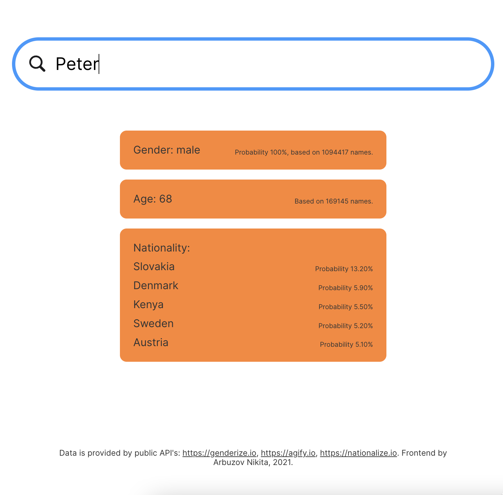

# Know your name

The idea of this app occurred to me when I stumbled upon a set of APIs made by Demografix ApP. The set consists of three APIs, all with the purpose to predict different pieces of information on the person with the given name based on statistical data.

## APIs used
- https://genderize.io/ gender prediction
- https://agify.io/ age prediction
- https://nationalize.io nationality prediction

These APIs use [114m rows dataset across 242 countries](https://genderize.io/our-data).

While the main purpose of the APIs (pointed out in the docs) is to provide analytics and segment the audience by making batch requests to each of the APIs separately, this app's idea is to provide a user interface and an entry point to all three APIs at once.

You can type in a name and get the information all APIs can offer in one place.

## Stack
I made this app for fun and to learn more about JS and data fetching from multiple sources (because each API has its own endpoint). So I didn't use any fancy frameworks. This app is intentionally written on vanilla JS with BEM styling (sick!), using an OOP pattern with classes. It also has no dependencies. I know that now no one writes this way. 😀

My goal was to get familiar with Web API by creating, appending, selecting, and styling all the DOM elements manually. In the process, I also learned more about Promises.

## Disclaimer
I have no relation to the development of the APIs and have no idea how they work under the hood, and what data and methods to process the data are used to make the assumptions.

## Demo
https://arbuznik.github.io/know-your-name/